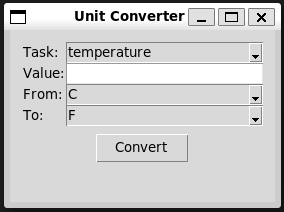

# Converter application

## How I solve this assignment

I used VScode copilot, in Agent mode with GPT-5 mini.

My input prompts were:

### First prompt

```
I want to create a small python program.
It should convert data from Fahrenheit, Celsius, and Kelvin.
And also from centemeters, to Inchs.

It should use to input ways.
1. it should interact the user for the task, then for input format and its value, and output format.
2. it should get as an command line argument a file. In format of task, input value, input foramt, output format. And output next to that file with a new name the output, which will have the input value and the output value in the 2 diffrent format.
(In case you didn't got a file, you should be interactive).

Add test in order to check yourself.
```

### Second Prompt

```
Now create another application that is simillar to the one we created, but that interact with the user with GUI using Tk
```

## Project Description

Simple Python program to convert temperatures (C/F/K) and lengths (cm/in).

Usage

- Interactive mode (prompts):

  python -m converter_cli

- File mode: provide a file where each non-empty line is a CSV record:

  task,input_value,input_unit,output_unit

  Examples:

  temperature,32,F,C
  length,2.54,cm,in

  Run:

  python -m converter_cli conversions.txt

  The program writes a new file next to the input named with `_converted` appended
  (e.g. `conversions_converted.txt`) with CSV output lines: task,input_value,input_unit,output_value,output_unit

- GUI

  Run the Tk GUI version (requires a display):

  python -m day02.gui

  The GUI lets you pick task (temperature/length), enter a value, choose input/output units and see the result.

  Screenshot:

  


### Tests

Run tests with pytest (recommended):

pip install pytest
pytest -q
