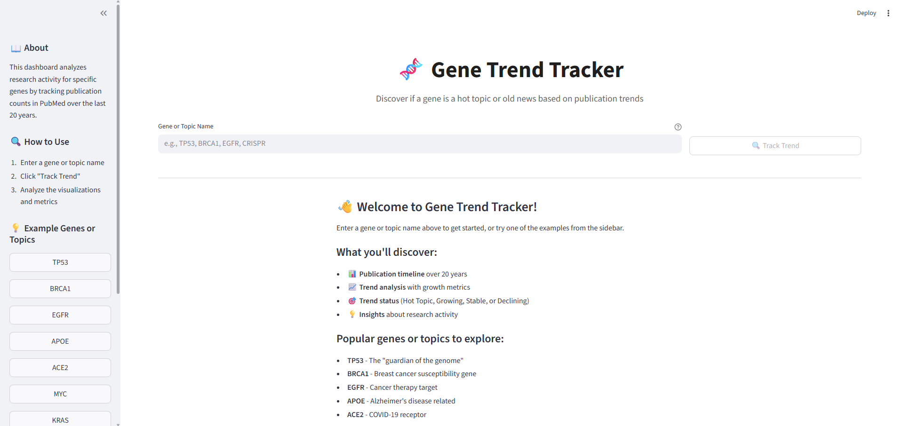
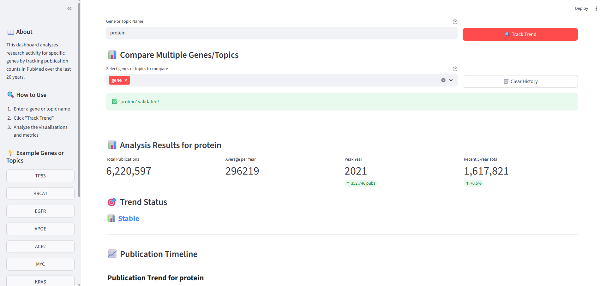
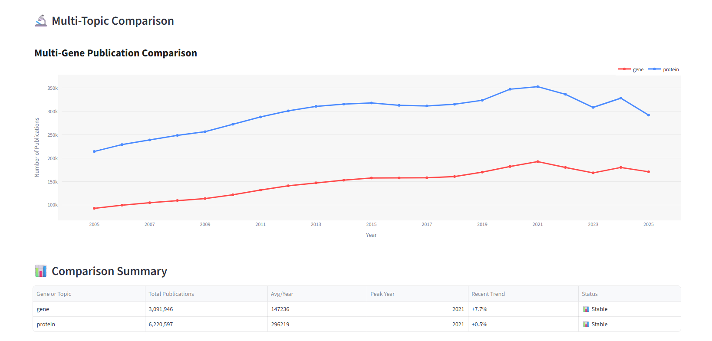

# Gene Trend Tracker 🧬

Track research activity trends for genes or topics by analyzing PubMed publication counts over the last 20 years.

## Screenshots

### Main Screen


### Search Topic


### Compare Topics



## Quick Start

```bash
# Install dependencies
pip install -r requirements.txt

# Run the application
streamlit run app.py
```

Open your browser to `http://localhost:8501`

## Features

- **Gene or Topic Search** - Search any gene or research topic (e.g., TP53, BRCA1, CRISPR, COVID-19)
- **Publication Timeline** - Interactive 20-year publication trend visualization
- **Trend Analysis** - Automatic classification (Hot Topic, Growing, Stable, or Declining)
- **Multi-Item Comparison** - Compare trends across multiple genes or topics side-by-side
- **Smart Caching** - Fast subsequent searches with local data caching
- **Progress Tracking** - Real-time progress indicators during data fetch

## How It Works

1. **Enter a gene or topic name** - Type any gene symbol or research topic in the input field
2. **Validation** - System verifies the term exists in PubMed database
3. **Data collection** - Fetches publication counts for each year (last 20 years)
4. **Analysis** - Calculates trends, growth rates, and statistics
5. **Visualization** - Interactive charts showing publication timeline and trends
6. **Comparison** - Add more items to compare trends side-by-side

## Example Genes or Topics

Try these popular genes or research topics:
- **TP53** - "Guardian of the genome" (cancer research)
- **BRCA1** - Breast cancer susceptibility gene
- **EGFR** - Epidermal growth factor receptor (cancer therapy)
- **APOE** - Alzheimer's disease related gene
- **ACE2** - COVID-19 receptor protein
- **MYC** - Proto-oncogene
- **KRAS** - Oncogene frequently mutated in cancers

## Configuration

### API Settings

Set environment variables:

```bash
PUBMED_EMAIL=your.email@example.com  # Optional but recommended
PUBMED_API_KEY=your_api_key          # Optional, for higher rate limits
```

### Application Settings

Edit `config.py` to customize:
- `YEARS_BACK` - Number of years to analyze (default: 20)
- `CACHE_DIR` - Cache directory location (default: "cache")
- `TREND_HOT_THRESHOLD` - Threshold for "Hot Topic" classification (default: 50%)
- `TREND_GROWING_THRESHOLD` - Threshold for "Growing" classification (default: 10%)

### UI Settings

Edit `ui_config.py` to customize:
- UI text and messages
- Color schemes
- Example items list
- Chart labels and titles

## Architecture

### Separation of Concerns

- **Logic Layer** - Pure business logic (no UI dependencies)
  - `pubmed_client.py` - API interactions
  - `data_processor.py` - Data processing and caching
  - `visualizer.py` - Chart generation

- **UI Layer** - User interface (no direct business logic)
  - `ui_components.py` - All Streamlit UI rendering
  - `ui_config.py` - UI text and styling

- **Orchestration** - Connects UI and logic
  - `app.py` - Main controller, coordinates between layers

- **Configuration** - Centralized settings
  - `config.py` - API settings, thresholds, constants
  - `ui_config.py` - UI text, colors, layouts

## Testing

```bash
# Run all tests
pytest tests/ -v

# Run specific test file
pytest tests/test_pubmed_client.py -v

# Run with coverage
pytest tests/ --cov=. --cov-report=html
```

## Technology Stack

- **Streamlit** - Web dashboard framework
- **Biopython** - NCBI PubMed API access (Bio.Entrez)
- **Plotly** - Interactive visualizations
- **Pandas** - Data manipulation
- **Pytest** - Testing framework

## Data Source

- **Database**: NCBI PubMed
- **Query**: Terms searched in `[Gene Name]` and `[Title/Abstract]` fields
- **Rate Limits**: 3 requests/second (without API key), 10 requests/second (with API key)

## License

This project is created for educational purposes as part of a Python course.